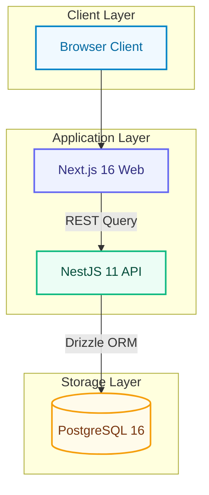
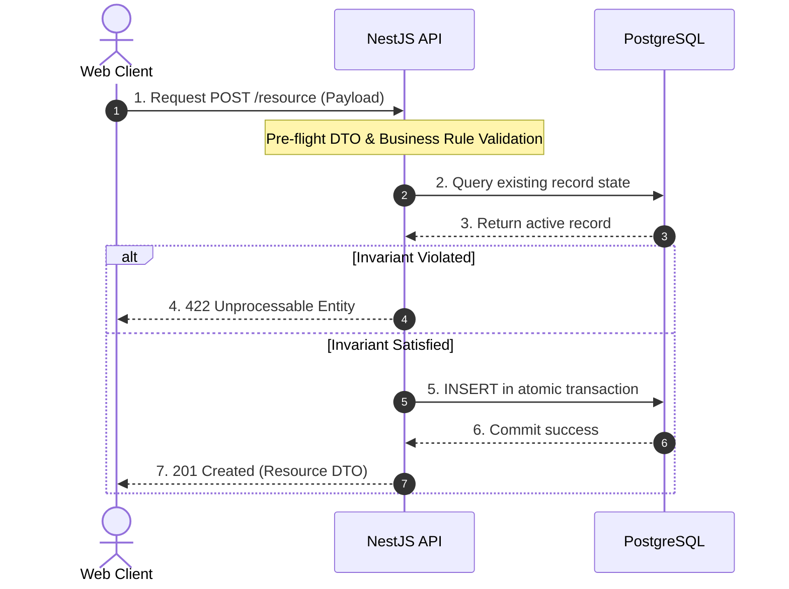
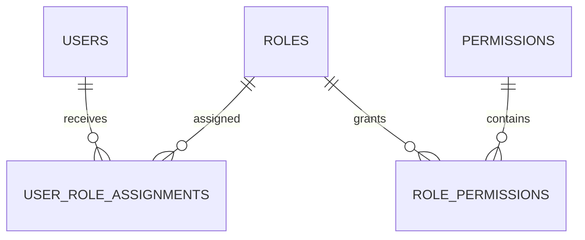

# Diagram Design Reference & Templates

Detailed technical specifications, color palettes, and copy-paste templates for Mermaid diagram design.

---

## 1. Complete Semantic Color Palette

All nodes must belong to one of these semantic classes to ensure project-wide visual consistency:

| Class Name | Role / Layer | Fill | Stroke (2px) | Text Color | Usage Example |
| :-- | :-- | :-: | :-: | :-: | :-- |
| `user` | User Personas | `#f0f9ff` | `#0284c7` | `#0369a1` | Public Visitor, Editor, CMS Admin |
| `app` | Frontend Applications | `#eef2ff` | `#6366f1` | `#312e81` | Next.js Web, Next.js Admin |
| `api` | Backend API & Services | `#ecfdf5` | `#10b981` | `#064e3b` | NestJS API, Controllers, Services |
| `db` | Databases & Storage | `#fffbeb` | `#f59e0b` | `#78350f` | PostgreSQL 16, MinIO S3 Storage |
| `auth` | Identity & Security | `#fff1f2` | `#f43f5e` | `#881337` | Keycloak 26, RBAC Guards, JWT Verify |
| `ext` | External Systems | `#faf5ff` | `#a855f7` | `#581c87` | Faculty Platform, Sibling APIs |
| `state` | Draft & Intermediate States | `#f8fafc` | `#64748b` | `#0f172a` | Working Draft, Preview Mode |
| `publish` | Published Snapshots | `#fef3c7` | `#d97706` | `#78350f` | Immutable Revision, Pointer Update |
| `live` | Live Public Serving | `#ecfdf5` | `#059669` | `#064e3b` | Public Website, ISR Revalidation |
| `rollback` | Rollback & Audit | `#fff1f2` | `#e11d48` | `#881337` | Historical Snapshot Recovery |

### Reusable `classDef` Block

```mermaid
classDef user fill:#f0f9ff,stroke:#0284c7,stroke-width:2px,color:#0369a1;
classDef app fill:#eef2ff,stroke:#6366f1,stroke-width:2px,color:#312e81;
classDef api fill:#ecfdf5,stroke:#10b981,stroke-width:2px,color:#064e3b;
classDef db fill:#fffbeb,stroke:#f59e0b,stroke-width:2px,color:#78350f;
classDef auth fill:#fff1f2,stroke:#f43f5e,stroke-width:2px,color:#881337;
classDef ext fill:#faf5ff,stroke:#a855f7,stroke-width:2px,color:#581c87;
classDef state fill:#f8fafc,stroke:#64748b,stroke-width:2px,color:#0f172a;
classDef publish fill:#fef3c7,stroke:#d97706,stroke-width:2px,color:#78350f;
classDef live fill:#ecfdf5,stroke:#059669,stroke-width:2.5px,color:#064e3b;
classDef rollback fill:#fff1f2,stroke:#e11d48,stroke-width:2px,color:#881337;
```

---

## 2. Architecture Diagram Template (Flowchart TD)

Use `flowchart TD` for multi-tiered application architecture diagrams:



---

## 3. Sequence Diagram Template

Sequence diagrams must always enable `autonumber` and use clear actor/participant roles with contextual note boxes:



---

## 4. Entity Relationship Diagram (ERD) Template

ERDs should use standard Crow's Foot notation with clean cardinality:



Cardinality key:

- `||--||`: Exactly one to exactly one
- `||--o{`: Exactly one to zero or many
- `}|--|{`: Many to many (resolve via junction tables)
- `||--o|`: Exactly one to zero or one

---

## 5. Common Anti-Patterns to Avoid

1. **Duplicate Mermaid in Markdown**: Never leave raw `mermaid ` code blocks in a markdown document that already embeds the rendered `` image. The `.mmd` file is the code source; the `.png` is the presentation.
2. **Unstyled Default Gray Boxes**: Never output plain default boxes with no `classDef` or semantic styling. Every diagram must look cohesive with the project's color palette.
3. **Dark / Black Backgrounds**: Avoid heavy dark backgrounds (`#000`, `#1e293b` fill) that swallow black text and fail to print or view cleanly in light-mode markdown viewers.
4. **Spaghetti Arrow Crossings**: If arrows cross more than 3 times, change layout orientation (`TD` ↔ `LR`) or group related nodes into subgraphs.
5. **Overcrowded Node Budgets**: A single diagram should not exceed 15 nodes. Split complex flows into an "Overview" diagram and focused "Sub-domain" diagrams.
