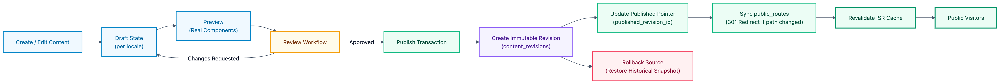

# API: Content Publishing Workflow

## 1. Publishing Lifecycle

Content publication follows a strict, audited, and atomic multi-step transaction per locale:

## 2. The Atomic Publish Transaction

Implemented in `ContentPublishingService.publish()`, the entire publish workflow executes inside a single database transaction block:

1. **Persisted State Validation**:
   - Verifies the content item exists and is not soft-deleted.
   - Verifies the translation exists for the target locale.
   - For `EVENT` items, verifies that event dates and venue are populated.
2. **Immutable Revision Creation**:
   - Generates an immutable snapshot containing all localized fields (title, slug, excerpt, body, event data).
   - Inserts into `content_revisions` with incremented `version_number` and actor audit ID.
3. **Pointer Mutation**:
   - Updates `content_translations.published_revision_id` to point to the newly created revision.
   - Sets `status = 'PUBLISHED'` and `published_at = NOW()`.
4. **Public Route & 301 Redirect Synchronization**:
   - Inserts or updates `public_routes` with `target_type = 'CONTENT'` and destination path.
   - If the path has changed from an earlier publication, a 301 permanent redirect is automatically generated in `redirects`.
5. **Audit Logging**:
   - Records an entry in `audit_logs` capturing `entity_type = 'content'`, `action = 'publish'`, revision ID, and actor ID.

## 3. Public Read Isolation Invariant

Public queries **never read draft columns** from `content_translations`. Instead, public queries inner-join `content_revisions` through `published_revision_id`, serving exclusively from the immutable snapshot. Editors can safely modify drafts without leaking unreviewed edits to visitors.

## 4. Rollback Transaction

Rollback creates a new draft populated from a historical snapshot:

1. Clones the snapshot from the target `content_revisions` record into `content_translations`.
2. Sets `status = 'DRAFT'`, prompting review before re-publication.
3. **Critical Invariant**: Restoring a draft does not immediately un-publish live content. The public site continues serving the active published revision until the newly restored draft is explicitly approved and published.
