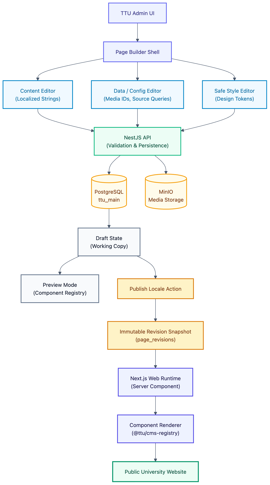

# Architecture: CMS & Page Builder

> **Status:** partially implemented — `apps/api/src/cms/` wires the full Page/Section/Publish/Rollback API against the existing `pages`/`page_sections`/`page_translations`/`page_revisions`/`page_section_translations` schema, validated against `@ttu/cms-registry` (see [`component-registry.md`](component-registry.md)). Only `hero` is registered so far (design doc 03 §3 is the only component with a complete field-level contract); the Admin Page Editor UI and the Next.js Web renderer are not built. See [`../../apps/api/IMPLEMENTATION_STATUS.md`](../../apps/api/IMPLEMENTATION_STATUS.md) §3.11.

## 1. Controlled Component CMS Philosophy

The `ttu-platform` content management architecture implements a **Controlled Component CMS** model rather than an unconstrained page builder like Elementor or raw HTML fields.

- **Developer Controlled**: Component markup, semantic HTML structure, responsive breakpoints, accessibility (WCAG 2.1), and allowed style tokens are maintained strictly in TypeScript and React code within the monorepo.
- **Administrator Controlled**: Page composition, component selection, sort order, localized textual content, media asset selection, and pre-approved safe visual styling presets.
- **Strictly Prohibited**: Injection of custom CSS, JavaScript scripts, raw HTML tags, Tailwind class strings, or arbitrary pixel positioning.



## 2. Page → Section → Component Model

Pages are modeled as an ordered collection of discrete sections. A section does not contain rendered HTML; instead, it stores an instance reference to a registered component key, version, configuration, safe style tokens, and localized content:

### Logical Data Structure of a Section

```json
{
  "componentKey": "hero",
  "componentVersion": 1,
  "config": {
    "backgroundImageId": "e3b0c442-98fc-1c14-9afbf4c8996fb924",
    "primaryButtonUrl": "/gioi-thieu"
  },
  "style": {
    "contentWidth": "xl",
    "textAlign": "center",
    "paddingTop": "xl",
    "paddingBottom": "xl",
    "background": "primary"
  },
  "translations": {
    "vi": {
      "content": {
        "eyebrow": "Đại học Tân Tạo",
        "title": "Kiến tạo tương lai từ tri thức",
        "subtitle": "Môi trường giáo dục khai phóng chuẩn Hoa Kỳ",
        "primaryButtonLabel": "Khám phá TTU"
      }
    },
    "en": {
      "content": {
        "eyebrow": "Tan Tao University",
        "title": "Empowering the Future Through Knowledge",
        "subtitle": "US-accredited liberal arts education environment",
        "primaryButtonLabel": "Explore TTU"
      }
    }
  }
}
```

## 3. The Three Component Data Zones

Every component cleanly partitions its operational data into three isolated zones:

### 3.1 Content (Localized)

Contains human-readable editorial text that requires per-locale translation (headlines, body copy, call-to-action labels, subtitles). Stored per-locale in `page_section_translations`.

### 3.2 Config (Technical & Data Source)

Contains functional parameters that are language-agnostic: media asset UUIDs, navigation target URLs, query filters, item count limits, or display toggles. Stored once per section in `page_sections.config`.

### 3.3 Style (Safe Design Tokens)

Contains presentation preferences chosen by the editor. Only approved semantic tokens (e.g. `sm`, `md`, `xl`, `primary`, `center`) are permitted. Stored once per section in `page_sections.style`. The frontend design system handles translation of tokens into CSS.

## 4. Static vs Dynamic Components

### Static Components

Self-contained components whose content is stored directly within the section translations:

- `Hero`
- `RichText`
- `ImageText`
- `CallToAction`
- `Statistics`
- `Gallery`

### Dynamic Components

Components that act as queries against existing domain models. They store query configuration only and resolve real-time data during rendering:

- `NewsGrid`: Queries `contents` and `content_translations` where `type = 'NEWS'`.
- `EventList`: Queries `contents`, `content_translations`, and `events`.
- `ProgramGrid`: Queries `programs` and `program_translations`.
- `FacultyGrid`: Queries external faculty integration endpoints from `ttu-faculty-platform`.

Articles and domain records are **never duplicated** into `page_sections`.

## 5. Independent Per-Locale Lifecycle

Editorial workflows operate completely independently for Vietnamese (`vi`) and English (`en`):

```plain text
Page P001
├── vi → PUBLISHED → points to Immutable Revision vi #14
└── en → DRAFT     → points to Immutable Revision en #8 (if previously published)
```

1. **Draft**: Editing a draft in one locale never modifies or corrupts the live published revision of either locale.
2. **Preview**: Renders the exact draft state using the frontend component catalog under the requested locale.
3. **Publish**: Atomically captures an immutable snapshot of shared render state (section order, config, styles) along with that locale's section translations into `page_revisions`, updates `published_revision_id` in `page_translations`, and syncs `public_routes`.
4. **Rollback**: Clones a historical snapshot for the target locale to initialize a fresh draft, leaving historical revision records untouched.

## 6. API Surface

`PagesController` (`apps/api/src/cms/controllers/pages.controller.ts`) follows the exact same convention `ContentController` established (design doc 06 §5): one resource, one URL. `GET /api/v1/pages`, `GET /api/v1/pages/:id`, and `GET /api/v1/pages/by-slug/:locale/:slug` branch on `page.read` between the full editorial view and the published-only delivery view (which also drops any section with `isVisible: false`, mirroring Navigation's delivery-tree filtering). Every write route requires its permission outright — `page.create`/`page.edit`/`page.delete`/`page.publish`/`page.restore`, already seeded per role in `role-permissions.catalog.ts`.

### Optimistic concurrency on section structure

`pages.lock_version` (design doc 06 §14) guards every structural mutation — create/update/delete a section, or reorder the list. The caller submits `expectedLockVersion`; the repository atomically checks-and-increments it in the same transaction as the write, returning nothing if it no longer matches, which the controller surfaces as `409 Conflict`. Content translation upserts don't participate in this lock — they're scoped to one section and one locale, not the page's shared shape.

### A known limitation of shared section structure and rollback

`page_sections`/`config`/`style` are locale-independent (doc 02 §8); `content` is the one part that's per-locale. `PagePublishingService.restore()` follows the exact precedent `ContentPublishingService.restore()` already sets for its own shared, non-per-locale `events` sub-resource: it unconditionally replaces the current data with whatever the snapshot being restored holds. For pages this means restoring one locale's revision recreates the _entire_ shared section structure from that snapshot, discarding any section-level content that existed only on other locales' still-current sections, and any structural edits made since that revision was published. This is a real, currently-unresolved product question (the design docs never address it) — not a bug to silently work around.
