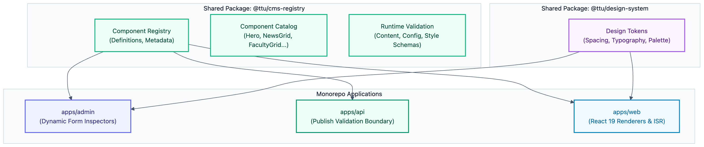

# Architecture: Component Registry & Design System

## 1. Role of the Component Registry

The Component Registry (`packages/cms-registry`) acts as the **single source of truth and contract** shared across all three applications in the monorepo:

- **Admin Dashboard (`apps/admin`)**: Uses component definitions to automatically generate form inspectors, field controls, and validation rules.
- **Backend API (`apps/api`)**: Uses runtime schemas (e.g. Zod) to validate section configurations, styles, and content during save and publish requests.
- **Public Website (`apps/web`)**: Maps registered component keys and versions to concrete React 19 component implementations.



## 2. Component Definition Anatomy

A registered component exports a strongly typed definition:

```ts
export interface ComponentDefinition<TContent, TConfig, TStyle> {
  key: string;
  version: number;
  name: string;
  category: 'layout' | 'marketing' | 'content' | 'university' | 'media' | 'utility';
  description: string;
  contentSchema: z.ZodType<TContent>;
  configSchema: z.ZodType<TConfig>;
  styleSchema: z.ZodType<TStyle>;
  defaultContent: TContent;
  defaultConfig: TConfig;
  defaultStyle: TStyle;
  variants: string[];
  editorMetadata: Record<string, FieldEditorMetadata>;
}
```

## 3. Safe Style Controls — Level A

To ensure robust visual governance, styling options are restricted to semantic design tokens:

### Spacing Tokens

```plain text
none | xs | sm | md | lg | xl | 2xl
```

Mapped by the design system into responsive padding/margin (e.g. `sm = 16px`, `md = 32px`, `lg = 48px`, `xl = 64px`).

### Width Tokens

```plain text
sm | md | lg | xl | 2xl | full
```

### Alignment Tokens

```plain text
left | center | right
```

### Background Presets

```plain text
default | surface | muted | primary | secondary | dark
```

### Typography Presets

```plain text
sm | md | lg | xl | display
```

The relational database stores only the token identifiers (`"xl"`, `"primary"`). The frontend design system resolves tokens to CSS variables and Tailwind classes.

## 4. Initial Component Catalog

The foundational 18-component set provides complete coverage for the university portal:

| Category | Component Key | Primary Purpose |
| :-- | :-- | :-- |
| **Marketing** | `hero` | Landing page banner with title, subtitle, CTAs, and background media |
| **Marketing** | `call-to-action` | High-conversion prompt with button actions and background options |
| **Marketing** | `statistics` | Numerical achievements counter (students, faculty count, international partners) |
| **Marketing** | `image-banner` | Visual editorial banner with overlaid messaging |
| **Layout** | `rich-text` | Structured prose, formatted paragraphs, blockquotes, and lists |
| **Layout** | `image-text` | Two-column split layout pairing imagery with descriptive narrative |
| **Layout** | `columns` | Multi-column grid container for nested content presentation |
| **Layout** | `spacer` | Managed vertical spacing between sections |
| **Content** | `news-grid` | Dynamic grid query displaying latest news articles by category |
| **Content** | `announcement-list` | Vertical list of official university notices and admissions deadlines |
| **Content** | `event-list` | Chronological event cards with dates, locations, and registration links |
| **Content** | `featured-article` | Full-width highlighted spotlight story |
| **University** | `faculty-grid` | Navigation grid linking to TTU's 7 faculties |
| **University** | `program-grid` | Degree showcase (Undergraduate, Graduate, Medical degrees) |
| **University** | `people-grid` | Leadership and notable faculty directory cards |
| **University** | `research-highlight` | Key research publications, laboratory achievements, and patents |
| **Media & Other** | `gallery` | Responsive media gallery grid with lightbox modal |
| **Media & Other** | `partner-logos` | Horizontal carousel / grid of academic and healthcare partner logos |

## 5. Component Versioning & Lifecycle

Every component definition carries an explicit integer version (`component_version`):

- **Patch / Non-breaking**: Bug fixes, responsive tweaks, and accessibility updates keep the version unchanged.
- **Breaking Changes**: Adding required fields, changing schema structures, or removing properties increments `version` (e.g. `v1` → `v2`).
- **Lifecycle Progression**: `active` → `deprecated` (old pages render safely; new insertions blocked in Admin) → `unsupported` (retired after migrations).
