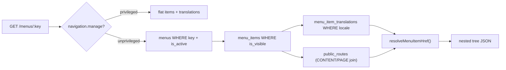

# Architecture: Navigation & Menus

> **Status:** implemented — `apps/api/src/navigation/` (backend priority: Navigation). See [`../../apps/api/IMPLEMENTATION_STATUS.md`](../../apps/api/IMPLEMENTATION_STATUS.md).

## 1. Model

A **menu** (`menus`) is a navigation context (`main-header`, `footer`, `quick-links` — doc 01 §12), addressed by its stable `key`. It contains a self-referential tree of **menu items** (`menu_items`), each with per-locale **translations** (`menu_item_translations`) carrying the visible `label` and, for `CUSTOM_PATH` items, the locale-specific target path.

There is no draft/publish workflow for navigation — unlike Content and (future) Pages, an edit takes effect immediately (doc 01 §12: "Admin phải có khả năng quản lý menu mà không cần redeploy frontend"). There is no revision history table for menus.

## 2. Link types

Each item is exactly one of 5 types, enforced by the DB's `menu_items_link_type_check` constraint and mirrored by `assertValidLinkTarget` (`menu-item-link.util.ts`) so a bad request gets a field-level `422` instead of a raw constraint violation:

| `linkType` | Required field | Resolves to |
| :-- | :-- | :-- |
| `PAGE` | `pageId` | `public_routes` row for that page/locale — always `null` today, the CMS Page Builder domain is blocked |
| `CONTENT` | `contentId` | `public_routes` row for that content item/locale |
| `EXTERNAL` | `externalUrl` | the URL itself |
| `CUSTOM_PATH` | none (target lives in the translation's `customPath`) | the translation's `customPath` |
| `GROUP` | none | nothing — a label-only container for children (dropdown/submenu) |

`linkType` and its target are immutable after creation (`UpdateMenuItemDto` only patches `parentId`/`sortOrder`/`isVisible`) — the same design as a category's `code`: changing what an item fundamentally points at means deleting and recreating it, not a routine field update.

## 3. One resource, one URL — `key` addressing throughout

`GET /api/v1/menus/:key` is the single read route for a menu, addressed by its immutable `key` (never `id` — `UpdateMenuDto` never lets `key` change, so it is as stable an identifier as the primary key). It branches on the caller's `navigation.manage` permission (design doc 06 §5):

- **Privileged:** returns every item for that menu **flat** (each row carries its own `parentId`), the same shape `CategoriesRepository` already uses for its hierarchy — not a server-built nested tree. An admin drag-and-drop editor assembles the tree client-side from that flat list.
- **Unprivileged (including anonymous):** returns the active menu's visible items as a **nested, resolved tree** for `?locale=` (default `vi`) — no separate route, same URL. Critically, **every item's `href` is already resolved server-side**; the frontend renders, it never resolves a target itself. `404` if the menu doesn't exist or isn't active.

Every other menu route (`POST /menus`, and every `:key/items...` write route) always requires `navigation.manage` — there is no unprivileged variant of a mutation.

Deleting a menu item with children is rejected with `409 Conflict` (`menu_items`'s self-referential FK is `ON DELETE RESTRICT`) — children must be reparented or removed first.

`resolveMenuItemHref` (`menu-item-link.util.ts`) is the single source of truth for the resolution rule per link type; `MenusRepository.resolveDeliveryTree` does the join and the flat-to-tree assembly for the unprivileged branch, while `listItemsWithTranslations` serves the privileged one.

## 4. Permission

`navigation.manage` (doc 07 §11) is the only permission this domain has — applied via `@RequirePermission('navigation.manage')` per write route, and as the branch condition (not a hard requirement) on the single read route. Unlike Content's `content.read`/`.create`/`.edit`/`.publish` split, navigation has no distinct read/write/publish separation in the design docs.

## 5. Verification

Verified directly against the real dev Postgres via `MenusRepository` (bypassing HTTP): a menu with an `EXTERNAL` item, a `CONTENT` item pointing at a genuinely published article, a `GROUP` with a `CUSTOM_PATH` child, and a hidden item — confirmed the hidden item is excluded, the `CONTENT` item's href resolves through the real `public_routes` row created by publishing, the tree nests correctly, and an inactive menu resolves to `undefined` (not an empty array). Also verified over real HTTP against the merged `GET /api/v1/menus/:key` route with real Keycloak-issued tokens: an anonymous request and a `navigation.manage`-holding request to the exact same URL return the flat-editor shape and the resolved-tree shape respectively; `GET /api/v1/menus` (list) 401s with no token and 403s for an authenticated caller lacking the permission; an unknown key 404s with the standard error envelope.
