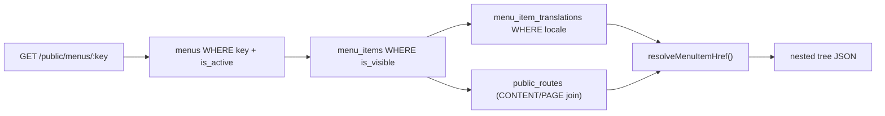

# Architecture: Navigation & Menus

> **Status:** implemented — `apps/api/src/navigation/` (backend priority: Navigation). See [`../../apps/api/IMPLEMENTATION_STATUS.md`](../../apps/api/IMPLEMENTATION_STATUS.md).

## 1. Model

A **menu** (`menus`) is a navigation context (`main-header`, `footer`, `quick-links` — doc 01 §12), addressed by its stable `key`. It contains a self-referential tree of **menu items** (`menu_items`), each with per-locale **translations** (`menu_item_translations`) carrying the visible `label` and, for `CUSTOM_PATH` items, the locale-specific target path.

There is no draft/publish workflow for navigation — unlike Content and (future) Pages, an edit takes effect immediately (doc 01 §12: "Admin phải có khả năng quản lý menu mà không cần redeploy frontend"). There is no revision history table for menus.

## 2. Link types

Each item is exactly one of 5 types, enforced by the DB's `menu_items_link_type_check` constraint and mirrored by `assertValidLinkTarget` (`menu-item-link.util.ts`) so a bad request gets a field-level `422` instead of a raw constraint violation:

| `linkType` | Required field | Resolves to |
| :-- | :-- | :-- |
| `PAGE` | `pageId` | `public_routes` row for that page/locale — always `null` today, the CMS Page Builder domain is blocked |
| `CONTENT` | `contentId` | `public_routes` row for that content item/locale |
| `EXTERNAL` | `externalUrl` | the URL itself |
| `CUSTOM_PATH` | none (target lives in the translation's `customPath`) | the translation's `customPath` |
| `GROUP` | none | nothing — a label-only container for children (dropdown/submenu) |

`linkType` and its target are immutable after creation (`UpdateMenuItemDto` only patches `parentId`/`sortOrder`/`isVisible`) — the same design as a category's `code`: changing what an item fundamentally points at means deleting and recreating it, not a routine field update.

## 3. Admin API — flat, client builds the tree

`GET /api/v1/admin/menus/:id` returns every item for that menu **flat** (each row carries its own `parentId`), the same shape `CategoriesRepository` already uses for its hierarchy — not a server-built nested tree. An admin drag-and-drop editor assembles the tree client-side from that flat list.

Deleting a menu item with children is rejected with `409 Conflict` (`menu_items`'s self-referential FK is `ON DELETE RESTRICT`) — children must be reparented or removed first.

## 4. Public API — nested, resolved tree

`GET /api/v1/public/menus/:key?locale=vi` is the one place navigation actually builds a tree: no auth, active menu only, visible items only, and — critically — **every item's `href` is already resolved server-side**. The frontend renders; it never resolves a target itself.

`resolveMenuItemHref` (`menu-item-link.util.ts`) is the single source of truth for the resolution rule per link type; `MenusRepository.resolvePublicTree` does the join and the flat-to-tree assembly.

## 5. Permission

Every navigation admin route is gated by a single permission, `navigation.manage` (doc 07 §11) — applied once at the controller class level rather than repeated per route, since (unlike Content's `content.read`/`.create`/`.edit`/`.publish` split) navigation has no distinct read/write/publish separation in the design docs.

## 6. Verification

Verified directly against the real dev Postgres via `MenusRepository` (bypassing HTTP): a menu with an `EXTERNAL` item, a `CONTENT` item pointing at a genuinely published article, a `GROUP` with a `CUSTOM_PATH` child, and a hidden item — confirmed the hidden item is excluded, the `CONTENT` item's href resolves through the real `public_routes` row created by publishing, the tree nests correctly, and an inactive menu resolves to `undefined` (not an empty array). Also verified over real HTTP: unauthenticated admin routes 401, a nonexistent public menu 404s with the standard error envelope, and a real menu inserted via SQL resolves correctly through `GET /api/v1/public/menus/:key`.
