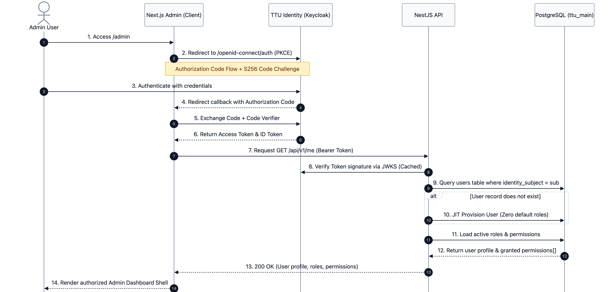

# Identity: Authentication & SSO

## 1. Authentication vs Authorization

TTU Platform strictly separates **identity authentication** from **application authorization**:

- **Authentication ("Who are you?")**: Managed centrally by **TTU Identity** (Keycloak 26). TTU Platform never stores passwords, hashes, or credentials.
- **Authorization ("What are you allowed to do?")**: Managed locally by **TTU Platform** (`ttu_main.roles` and `ttu_main.permissions`).

A user who successfully logs into Keycloak is not automatically granted CMS editing or publishing permissions.

## 2. OIDC Login Flow (PKCE) — implemented in `apps/admin`

The admin frontend authenticates against Keycloak using OpenID Connect (OIDC) **Authorization Code Flow with PKCE**, implemented as a server-side (BFF) flow — `apps/admin/src/lib/auth/`, `apps/admin/src/app/api/auth/`, `apps/admin/src/proxy.ts`:

1. `GET /api/auth/login` generates `state`, `nonce`, and a PKCE `code_verifier`/`code_challenge` (S256), stores them in a short-lived encrypted transaction cookie, and redirects to Keycloak's `/protocol/openid-connect/auth`.
2. `GET /api/auth/callback` validates `state` against the transaction cookie, exchanges the authorization code (with `code_verifier`) at the token endpoint, and verifies the returned ID token's signature/issuer/`azp`/`nonce` via `jose`.
3. The resulting session — `sub`, cached `email`/`displayName`, access token, refresh token, and their expiries — is encrypted (AES-256-GCM, `jose` `EncryptJWT`) into an `HttpOnly`, `SameSite=Lax` cookie. The browser is never given a token in any form its own JS can read.
4. `proxy.ts` (Next.js 16's `middleware.ts` successor) gates every page: no session → redirect to login; access token expiring within 30s → transparently refreshed via the token endpoint and the cookie rewritten; refresh token also expired → redirect to login.
5. `POST /api/auth/logout` clears the local session cookie only — design doc 07 §5 scopes Admin logout to ending TTU Platform's own session; SSO-wide logout is TTU Identity's policy, not this app's to enforce.

## 3. JWT Verification at the API

The NestJS API guard (`JwtAuthGuard`) verifies incoming Bearer tokens using `jwks-rsa`:

- **JWKS Endpoint**: Derived dynamically from `KEYCLOAK_ISSUER_URL` (`/protocol/openid-connect/certs`).
- **In-Memory Key Caching**: Caches public signing keys for 10 minutes with rate limiting, eliminating per-request HTTP round-trips to Keycloak.
- **Claims Verified**: Validates `iss` (issuer), `azp` (client ID `ttu-web`), and `exp` (token expiration).

## 4. Just-In-Time (JIT) Provisioning

When a valid Keycloak user authenticates for the first time:

1. The API extracts the `sub` claim and queries `users.identity_subject`.
2. If absent, a new `users` record is provisioned with `displayName` and `email` cached from token claims.
3. **Security Rule**: The newly provisioned user receives **zero default roles or permissions**. CMS access must be explicitly granted by a Super Administrator.
