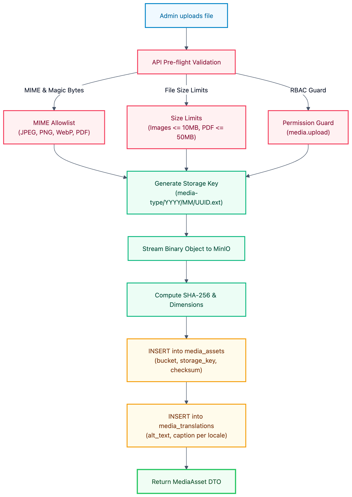

# Media: Storage & Asset Pipeline

> **Status:** implemented — `apps/api/src/media/` (backend priority #6). See [`../../apps/api/IMPLEMENTATION_STATUS.md`](../../apps/api/IMPLEMENTATION_STATUS.md) §3.6.

## 1. Architecture: Decoupling Binary from Database

TTU Platform adheres to a strict storage boundary:

- **MinIO S3 Storage**: Stores all binary objects (photos, PDFs, documents, videos).
- **PostgreSQL Database (`ttu_main.media_assets`)**: Stores metadata, original filenames, dimensions, checksums, and uploader identities.
- **Application References**: Content items and page builder sections store only `media_assets.id` (UUID), never raw physical storage URLs.



## 2. Media Upload Pipeline

`POST /api/v1/admin/media` accepts a single `multipart/form-data` `file` field (`FileInterceptor` + in-memory Multer storage — files never touch disk on the API host). `media-upload.service.ts` runs the pipeline synchronously in one request: MIME allowlist check → size-limit check → magic-byte signature check → image dimension extraction (`image-size`, images only) → SHA-256 checksum → backend-generated storage key → `PutObject` to MinIO → `media_assets` insert. If the metadata insert fails after a successful object write, the just-written object is deleted (best-effort) so a failed upload never leaves an orphan in MinIO.

## 3. File Validation & Size Policies

- **MIME Allowlist**: `image/jpeg`, `image/png`, `image/webp`, `application/pdf`. (SVG files are restricted to prevent XSS attacks).
- **Size Limits**: Images capped at 10 MB; PDFs capped at 50 MB.
- **Key Generation**: Keys are systematically generated by the backend to avoid path traversal and character encoding defects:
  ```plain text
  images/2026/09/e3b0c442-98fc-1c14-9afbf4c8996fb924.webp
  documents/2026/09/6b86b273-ff34-fce1-9d6b-804eff5a3f57.pdf
  ```

## 4. Localized Alt Text & Accessibility

Alt text and captions are stored in `media_translations` to support internationalization and screen-reader accessibility:

```plain text
media_assets (id: e3b0c442)
├── media_translations (locale: vi) → "Khuôn viên Đại học Tân Tạo"
└── media_translations (locale: en) → "Tan Tao University Campus"
```

## 5. Deletion Protection

`DELETE /api/v1/admin/media/:id` soft-deletes (`deleted_at`); `POST /api/v1/admin/media/:id/restore` undoes it. Before soft-deleting, `MediaAssetsRepository.isReferenced()` checks whether the asset is reachable from _live_ data:

1. A `contents` row's `featured_media_id`, or a `content_translations` row's `og_image_id`, where that locale has actually been published (`published_revision_id IS NOT NULL`) — a draft-only reference does not block deletion.
2. An active (`is_active = true`) `people.portrait_media_id` or `partners.logo_media_id` — those two entities have no separate draft/publish state.

`page_sections` is not checked: the CMS Page Builder domain does not exist yet (blocked on the Component Registry — see `apps/api/IMPLEMENTATION_STATUS.md` §5.1). If referenced, deletion is rejected with `409 Conflict`. Otherwise a soft-delete timestamp (`deleted_at`) is set, retaining the physical object; a retention-window purge job is future scope (doc 08 §18-19), not implemented.

## 6. Delivery

`ttu-data-infra` provisions a single bucket, `ttu-media`, with an anonymous-download bucket policy (`minio/init/create-buckets.sh`), plus a scoped `app-readwrite` service account distinct from the MinIO root user — the API never holds root MinIO credentials. Every media response therefore includes a plain, immutable `url` field (`{S3_PUBLIC_URL_BASE}/{bucket}/{key}`), not a signed one; `S3_PUBLIC_URL_BASE` is a separate config value from the write `S3_ENDPOINT` so production can front reads with a CDN/reverse-proxy domain later without changing any stored `media_assets` row.

## 7. Admin API

| Method | Path | Required Permission | Description |
| :-- | :-- | :-- | :-- |
| `GET` | `/api/v1/admin/media` | `media.read` | Paginated list, optional `mimeType`/`search` filters. |
| `GET` | `/api/v1/admin/media/:id` | `media.read` | Asset metadata, resolved delivery URL, and translations. |
| `POST` | `/api/v1/admin/media` | `media.upload` | Multipart upload — validates, stores, persists metadata. |
| `PUT` | `/api/v1/admin/media/:id/translations/:locale` | `media.update` | Upsert alt text / caption for a locale. |
| `DELETE` | `/api/v1/admin/media/:id` | `media.delete` | Soft-delete; `409` if still referenced by live data. |
| `POST` | `/api/v1/admin/media/:id/restore` | `media.delete` | Undo a soft-delete (doc 08 §24 has no dedicated restore permission). |
