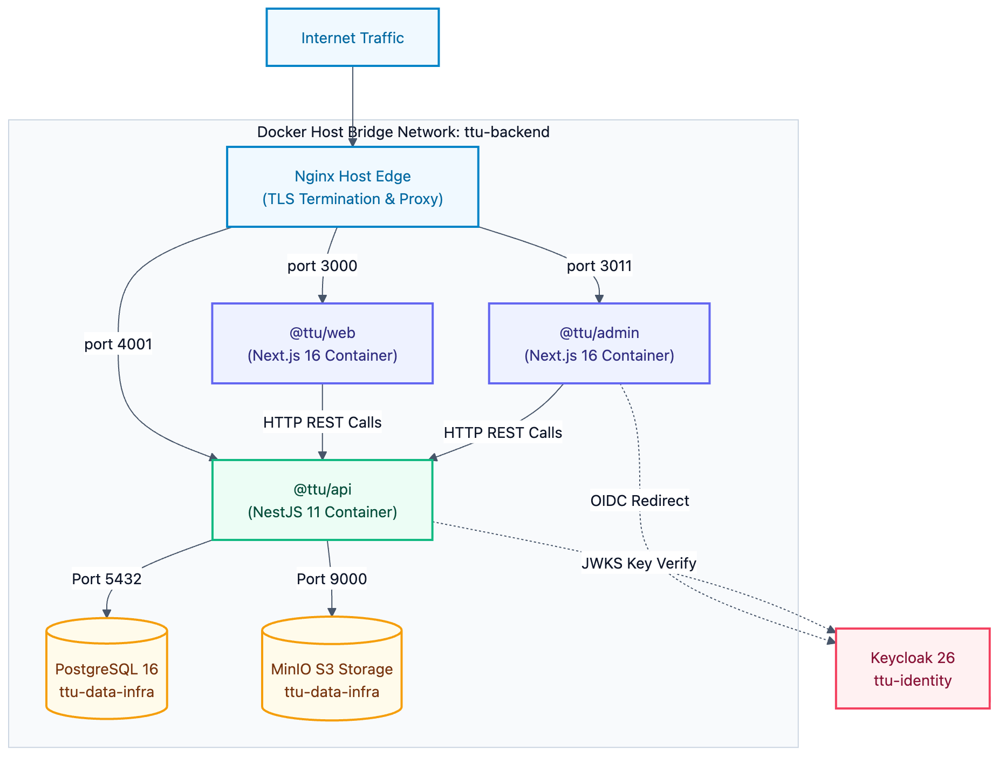

# Operations: Production Deployment & Topology

## 1. Production Topology

In production, TTU Platform applications run as isolated Docker containers on an Ubuntu host, joining the shared `ttu-backend` bridge network:

## 2. Host Nginx Reverse Proxy Mapping

The host Nginx server terminates TLS certificates and proxies traffic to the respective container ports:

| Domain | Target Container | Container Port | Purpose |
| :-- | :-- | :-: | :-- |
| `ttu.edu.vn` | `@ttu/web` | `3000` | Public university web portal |
| `admin.ttu.edu.vn` | `@ttu/admin` | `3000` _(mapped to host 3011)_ | Content administration dashboard |
| `api.ttu.edu.vn` | `@ttu/api` | `4001` | Backend REST API |

## 3. Environment Variables & Secret Separation

Sensitive credentials never enter version control:

- Local development values use `.env.example` templates.
- Production environment variables are maintained on the host server (`env/production/api.env`, `env/production/web.env`, `env/production/admin.env`).
- Database and MinIO credentials connect directly across the shared Docker network (`ttu-data-infra_postgres:5432` and `ttu-data-infra_minio:9000`).
