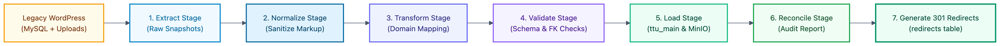

# Operations: WordPress Migration Pipeline

## 1. Migration Philosophy

WordPress is strictly a **data source**, not a target schema model. Legacy generic tables (`wp_posts`, `wp_postmeta`, `wp_options`) are transformed into domain-driven PostgreSQL models:

## 2. The 7-Stage Pipeline

1. **Extract**: Dumps legacy MySQL posts, attachments, taxonomy terms, and metadata into raw JSON snapshot files.
2. **Normalize**: Strips obsolete HTML styles, deprecated shortcodes, and Gutenberg comment fences; cleans Unicode characters and malformed whitespace.
3. **Transform**: Maps normalized post data into TTU domain entities:
   - Articles → `contents` + `content_translations` (`NEWS`, `ANNOUNCEMENT`, `EVENT`).
   - Categories / Tags → `categories` and `tags` with hierarchical assignments.
   - Attachments → Uploaded to MinIO, generating `media_assets` and `media_translations`.
4. **Validate**: Verifies all required fields, validates slug formats, and ensures referenced foreign keys exist before insertion.
5. **Load**: Inserts validated records into `ttu_main` and streams binary files to MinIO.
6. **Reconcile**: Generates an audit reconciliation report comparing source vs target record counts.
7. **Redirect Generation**: Populates `redirects` with `301` permanent redirect rules from legacy WordPress permalinks to new canonical paths.
