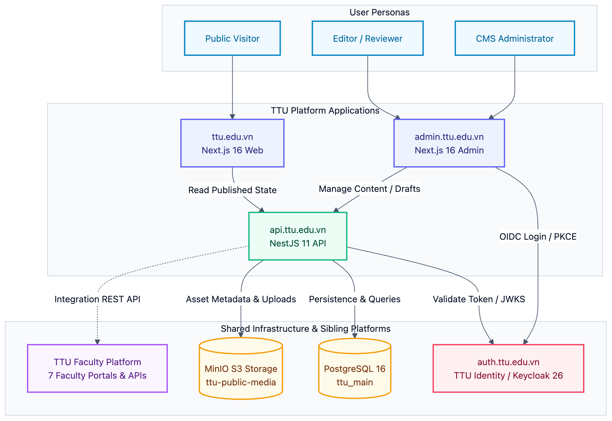

# System Overview

## 1. What This Is

`ttu-platform` is the unified web and content platform powering the official digital presence of **Tan Tao University** at [ttu.edu.vn](https://ttu.edu.vn). It replaces the legacy WordPress implementation with a modern, high-performance monorepo architecture engineered for security, internationalization, and editorial autonomy.

The platform unifies three primary software surfaces backed by a single central business database (`ttu_main`) and shared object storage:

- **Public Website (`ttu.edu.vn`)**: High-speed, search-engine-optimized university portal built with Next.js 16 App Router and React 19.
- **Admin Dashboard (`admin.ttu.edu.vn`)**: Controlled-component editorial management system built with Next.js 16 App Router and React 19.
- **Backend API (`api.ttu.edu.vn`)**: High-throughput REST API and business logic engine built with NestJS 11 and Drizzle ORM.

## 2. High-Level Architecture

The system operates across distinct layers, separating public reads, administrative mutations, and shared infrastructure:

## 3. Sibling Repositories & Platform Boundaries

`ttu-platform` is part of a 4-repository ecosystem designed to be deployed side-by-side:

| Repository | Responsibility | Technology Stack |
| :-- | :-- | :-- |
| [**ttu-data-infra**](https://github.com/tan-tao-university/ttu-data-infra) | Shared PostgreSQL 16 cluster and MinIO S3 object storage | PostgreSQL 16 (`ttu_main`), MinIO |
| [**ttu-identity**](https://github.com/tan-tao-university/ttu-identity) | Centralized authentication, Single Sign-On (SSO), and identity provider | Keycloak 26, OpenID Connect (`ttu` realm) |
| [**ttu-faculty-platform**](https://github.com/tan-tao-university/ttu-faculty-platform) | 7 independent faculty portals (`*.ttu.edu.vn`), faculty admin dashboards & APIs | Next.js 16, NestJS 11, PostgreSQL (`ttu_faculty`) |
| [**ttu-platform**](https://github.com/tan-tao-university/ttu-platform) _(this repo)_ | Main university portal, CMS admin dashboard, and central API | Next.js 16, NestJS 11, PostgreSQL (`ttu_main`) |

### Strict Faculty Boundary Invariant

`ttu_main` **never stores faculty registry tables, faculty staff rosters, or faculty-specific courses**. All faculty-specific data belongs to `ttu-faculty-platform`. When the main website links to a faculty, it uses canonical external links or dynamic integration REST APIs, never a direct database join across systems.

## 4. Application Monorepo Structure

| Application | Package | Directory | Local Dev Port | Production Routing |
| :-- | :-- | :-- | :-: | :-- |
| **Public Website** | `@ttu/web` | `apps/web` | `3000` | Reverse proxy routes `ttu.edu.vn` to container port `3000` |
| **Admin Dashboard** | `@ttu/admin` | `apps/admin` | `3011` | Reverse proxy routes `admin.ttu.edu.vn` to container port `3000` |
| **Backend API** | `@ttu/api` | `apps/api` | `4001` | Reverse proxy routes `api.ttu.edu.vn` to container port `4001` |

_Development ports (3000, 3011, 4001) are chosen to prevent conflicts with `ttu-faculty-platform` (3010, 4000) running on the same host._
